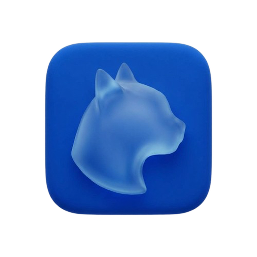
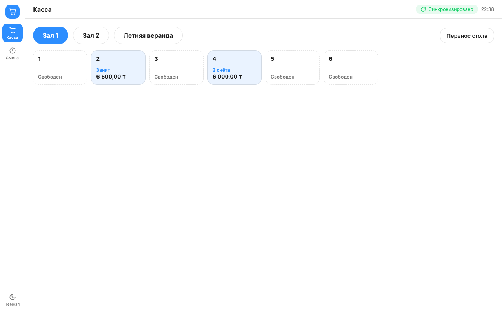
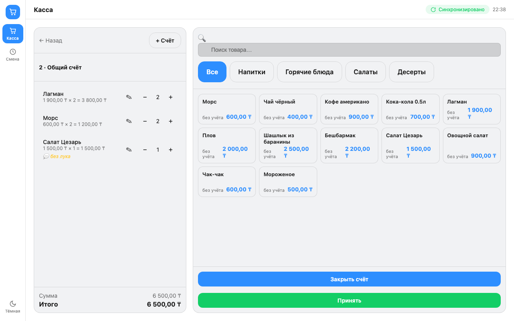
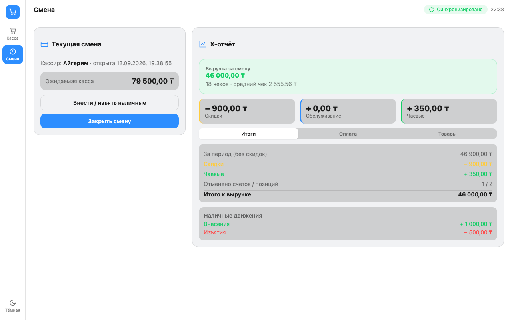
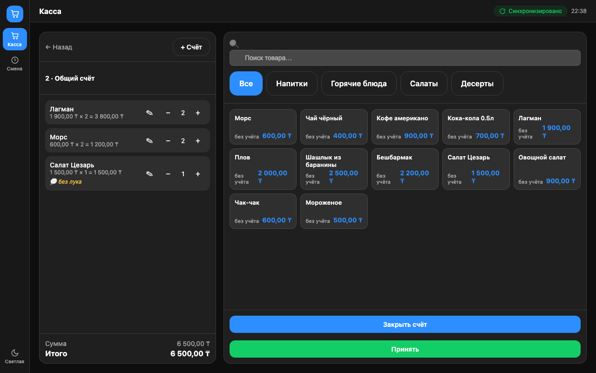

<p align="center">
  
</p>

<h1 align="center">Neko POS</h1>
<p align="center">Современная касса для ресторанов, кафе, баров, кофеен и кальянных в Казахстане</p>
<p align="center"><b>Текущая версия: 0.4.6</b></p>

---

## Что это

Neko POS — кассовое ПО нового поколения для любых заведений общественного
питания: ресторан, фастфуд, кафе, бар, кофейня, кальянная — любой формат с
залом, гибким меню и оплатой на месте. Подписка от **9 900 ₸/мес**, без
скрытых платежей и многолетних контрактов.

Касса — отдельная программа под конкретное заведение, работает на вашем же
оборудовании (Windows/macOS/Linux), а не в браузере: столы, залы, меню и
товары настраиваются один раз в личном кабинете на сайте и подтягиваются
на кассу автоматически по ключу подписки.

## Установка

**macOS** (Apple Silicon):
```bash
curl -fsSL https://raw.githubusercontent.com/aliaskh4n/NekoPOS/main/install.sh | bash
```

**Linux** (x86_64):
```bash
curl -fsSL https://raw.githubusercontent.com/aliaskh4n/NekoPOS/main/install-linux.sh | bash
```

**Windows** (PowerShell):
```powershell
irm https://raw.githubusercontent.com/aliaskh4n/NekoPOS/main/install.ps1 | iex
```

Скрипт сам скачает актуальную версию, проверит её и установит: macOS — в
`/Applications`, Linux — в `~/.local/share/nekopos` с ярлыком в меню
приложений, Windows — в `%LOCALAPPDATA%\NekoPOS` с ярлыком в Пуске.

<details>
<summary>Установить вручную (скачать файл со страницы Releases)</summary>

Файлы на странице [Releases](../../releases):

```
pos-windows-amd64.exe
pos-linux-amd64.tar.gz
pos-darwin-arm64.zip
```

При первом запуске система может спросить подтверждение (неизвестный
источник) — на macOS: ПКМ по `Neko POS.app` → «Открыть» → «Открыть»; на
Windows: «Подробнее» → «Выполнить в любом случае». На Linux после
распаковки сделайте бинарник исполняемым: `chmod +x pos-linux-amd64`.

</details>

## Возможности

- **Столы и залы** — экран зала, перенос стола/счёта, несколько открытых
  счетов на стол.
- **Гибкое меню** — категории любой вложенности: «Кухня» → «Фастфуд»,
  «Бар» → «Коктейли», «Кальян» → «Крепкий» — подходит и ресторану, и
  кофейне, и кальянной одновременно.
- **Оплата** — наличные, карта, несколько способов оплаты одним чеком,
  скидка, сервисный сбор, чаевые.
- **Смена** — открытие/закрытие с подсчётом кассы, внесения и изъятия
  наличных, X-отчёт и Z-отчёт с разбивкой по способам оплаты, терминалам
  и категориям меню.
- **Фискализация (reKassa)** — чек не блокирует продажу, если касса
  временно офлайн, но и не работает бесконтрольно долго без связи.
- **LAN API** — локальный HTTP API для сторонних интеграций в той же
  сети: кухонный экран, приложение официанта и т.п.
- **Автообновления** — касса сама проверяет новую версию при каждом
  запуске и обновляется без переустановки.
- Светлая/тёмная тема, адаптивный интерфейс, PIN-блокировка экрана.

## Технологии

- **Backend**: Go, SQLite (`modernc.org/sqlite`).
- **UI**: [Wails v2](https://wails.io) — нативное окно на системном
  webview + HTML/CSS/JS, без Electron.
- **Личный кабинет и веб-админка**: React/TypeScript, отдельный сервис.

## Скриншоты

_Интерфейс на демо-данных (не реальное заведение)._

| Столы и залы | Открытый счёт |
|---|---|
|  |  |

| Смена — X-отчёт | Тёмная тема |
|---|---|
|  |  |
